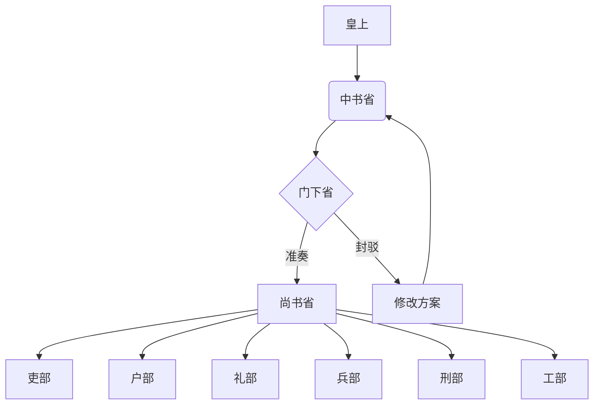

# 三省六部项目综合报告

## 项目概述
三省六部是中国古代中央官制的重要组成部分，也是本项目的组织架构模型。本项目采用三省六部制作为分布式协作框架，模拟古代官僚体系的分工协作机制。

## 三省职责
- **中书省**：负责接收皇上旨意，起草执行方案，调用门下省审议，通过后调用尚书省执行
- **门下省**：负责审议中书省提交的方案，决定准奏或封驳
- **尚书省**：负责执行已准奏的方案，协调六部具体实施

## 六部职责
- **吏部**：人事管理、官员考核
- **户部**：财务、资产、资源管理
- **礼部**：礼仪制度、规范标准
- **兵部**：安全、防御、应急响应
- **刑部**：法律事务、纠纷仲裁
- **工部**：工程建造、技术开发

## 工作流程
1. 皇上发布旨意
2. 中书省接收并分析旨意
3. 起草执行方案
4. 提交门下省审议
5. 门下省准奏或封驳
6. 准奏后转尚书省执行
7. 尚书省派发至相关六部
8. 六部具体实施并反馈结果
9. 汇总结果回奏皇上

## 关键文件说明
- `AGENTS.md`：定义各代理的工作协议
- `SOUL.md`：中书省行为规范
- `scripts/`：自动化脚本目录
- `data/`：运行时数据存储

## 技术架构
本项目基于 OpenClaw 框架实现，采用 Agent 协作模式，通过看板系统跟踪任务状态流转。

## 任务流转协议
- 任务ID格式：JJC-YYYYMMDD-HHMMSSmmm
- 状态流转：Zhongshu → Menxia → Assigned → InProgress → Done
- 每个环节需更新看板状态并记录进展

## 使用方法
1. 发布任务指令
2. 系统自动分配至相应部门
3. 按照既定流程执行
4. 定期查看看板了解进度

## 流程图说明
以下是三省六部工作流程的可视化表示：

### 节点说明
- **皇上**: 任务发起方，负责发布旨意
- **中书省**: 负责接收旨意并起草执行方案
- **门下省**: 审议中书省提交的方案，决定是否准奏
- **尚书省**: 执行已准奏的方案，并派发给六部
- **修改方案**: 当门下省封驳时，返回中书省修改
- **六部**: 各专业部门，负责具体执行任务

### 流程说明
1. 皇上发布旨意至中书省
2. 中书省起草方案并提交门下省审议
3. 门下省决定准奏或封驳
4. 准奏则转尚书省执行，封驳则返回中书省修改
5. 尚书省将任务派发给相应的六部执行
6. 六部完成任务并反馈结果

## 总结
三省六部制是一个高效的分权协作体系，通过明确的职责分工和制衡机制，确保任务能够有序、高效地执行。本项目通过现代技术手段重现这一古老而有效的管理体系，实现了自动化、可视化的任务流转过程。
