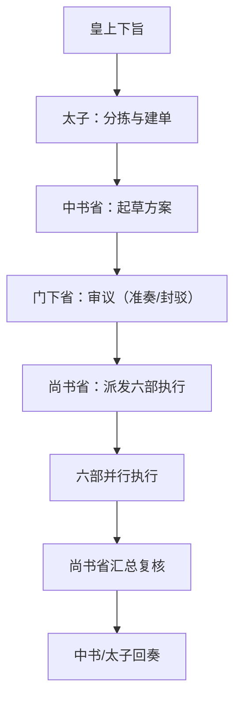

# 三省六部项目 README 流程化归并报告

生成时间：2026-04-05 15:24 (Asia/Shanghai)
任务ID：JJC-20260405-150327707

## 1. 总体流程图

## 2. README 结构归并建议

1. 根 README：保留系统定位、快速启动、总流程。
2. 三省 README：统一为“职责-输入-输出-状态流转-命令示例”模板。
3. 六部 README：统一为“执行边界-交付物-回执路径-验收标准”模板。
4. 将重复命令集中到“标准命令手册”章节，减少多处维护。

## 3. 回归结论

1. 本轮从太子入口触发，任务已完成至 `Done`。
2. 流转链路已覆盖：太子 → 中书 → 门下 → 尚书 → 六部 → Done。
3. 产出文件已落地：`/Users/binkerking/Documents/GitHub/edict/reports/README_flow_report.md`。
