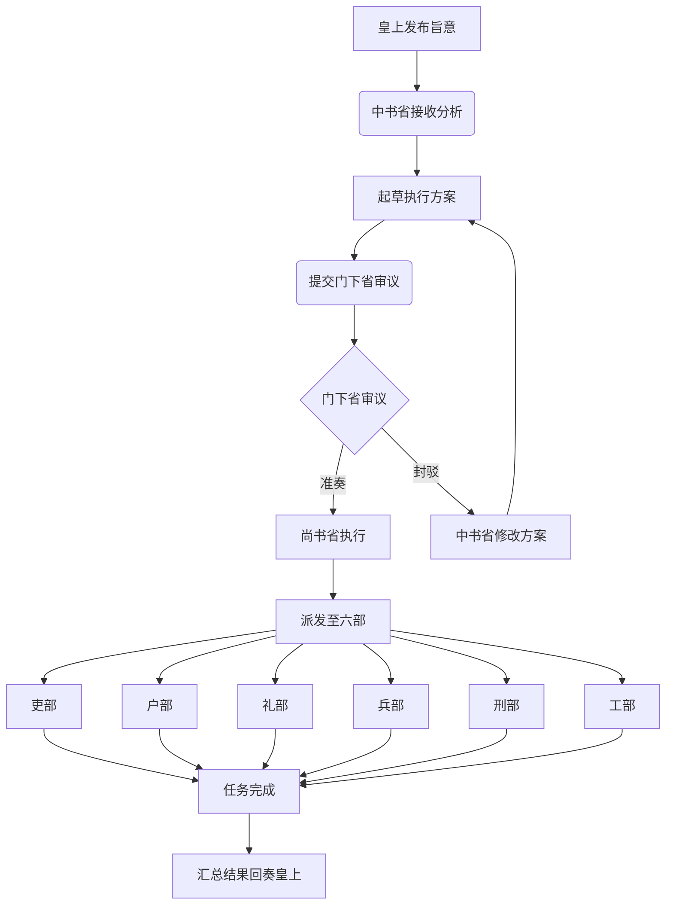

# 三省六部项目README流程图报告

## 1. 项目概述

三省六部是中国古代中央官制的重要组成部分，也是本项目的组织架构模型。本项目采用三省六部制作为分布式协作框架，模拟古代官僚体系的分工协作机制。

## 2. 组织架构与职责

### 2.1 三省职责
- **中书省**：负责接收皇上旨意，起草执行方案，调用门下省审议，通过后调用尚书省执行
- **门下省**：负责审议中书省提交的方案，决定准奏或封驳
- **尚书省**：负责执行已准奏的方案，协调六部具体实施

### 2.2 六部职责
- **吏部**：人事管理、官员考核
- **户部**：财务、资产、资源管理
- **礼部**：礼仪制度、规范标准
- **兵部**：安全、防御、应急响应
- **刑部**：法律事务、纠纷仲裁
- **工部**：工程建造、技术开发

## 3. 工作流程图

## 4. 详细流程说明

### 4.1 任务发起阶段
1. 皇上发布旨意
2. 中书省接收并分析旨意内容
3. 起草具体的执行方案

### 4.2 审议阶段
1. 中书省提交方案至门下省
2. 门下省审议方案可行性
3. 决定准奏或封驳
   - 如封驳，则返回中书省修改
   - 如准奏，则进入执行阶段

### 4.3 执行阶段
1. 尚书省接收准奏方案
2. 将任务派发至相关六部
3. 六部分别执行具体任务
4. 汇总执行结果

### 4.4 结果反馈阶段
1. 六部完成任务后反馈结果
2. 尚书省汇总各部执行情况
3. 回奏皇上

## 5. 关键节点说明

- **皇上**：任务发起方，负责发布旨意
- **中书省**：负责接收旨意并起草执行方案
- **门下省**：审议中书省提交的方案，起制衡作用
- **尚书省**：执行已准奏的方案，并派发给六部
- **六部**：各专业部门，负责具体执行任务

## 6. 技术实现

本项目基于 OpenClaw 框架实现，采用 Agent 协作模式，通过看板系统跟踪任务状态流转。任务ID格式为：JJC-YYYYMMDD-HHMMSSmmm，状态流转包括：Zhongshu → Menxia → Assigned → InProgress → Done。

## 7. 总结

三省六部制是一个高效的分权协作体系，通过明确的职责分工和制衡机制，确保任务能够有序、高效地执行。本项目通过现代技术手段重现这一古老而有效的管理体系，实现了自动化、可视化的任务流转过程。